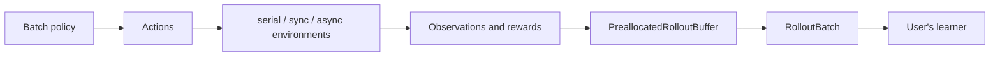

# Architecture

The runtime separates three concerns:

1. environment execution;
2. batched policy inference;
3. fixed-shape rollout storage.

The policy stays in the parent process. In `async` mode, worker processes only
own environments and communicate NumPy observations, actions, rewards, and
termination flags. This keeps CUDA state out of spawned workers and makes the
same API usable on native Windows.

## Backend trade-offs

- `serial` is the reference implementation and is useful for debugging.
- `sync` avoids inter-process communication and is often best for lightweight
  environments.
- `async` uses one spawned process per environment and is intended for more
  expensive or blocking environment steps.

No backend is assumed to be universally fastest. The benchmark measures the
trade-off instead of hiding it behind one default claim.

